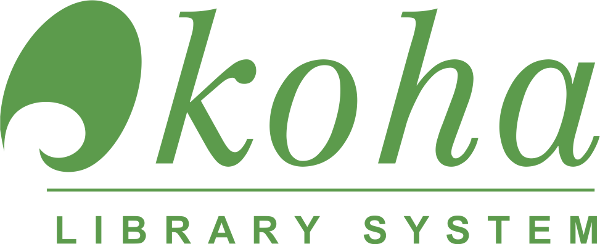

# KOHA (Software)

    

Sumber : [Wikipedia](<https://en.wikipedia.org/wiki/Koha_(software)>)

Koha merupakan sistem perpustakaan terintegrasi atau dalam bahasa inggris nya disebut _open source integrated library system (ILS)_, digunakan di seluruh dunia oleh perpustakaan umum, sekolah dan khusus. Nama Koha berasal dari istilah Māori yang berarti hadiah atau sumbangan.

## Fitur

Koha adalah ILS berbasis web, dengan database SQL (MariaDB atau MySQL) sistem back end dengan katalogisasi data yang disimpan di MARC dan dapat diakses melalui Z39.50 atau SRU. Antarmuka pengguna dapat dikonfigurasi dan beradaptasi dan telah diterjemahkan ke dalam banyak bahasa. Koha memiliki sebagian besar fitur yang diharapkan dalam ILS, termasuk:

- Berbagai fasilitas Web 2.0 seperti penandaan, komentar, berbagi sosial, dan umpan RSS
- Fasilitas katalog serikat
- Pencarian yang dapat disesuaikan
- Sirkulasi online
- Pencetakan kode batang
- Pembuatan kartu pelindung
- Pembuatan laporan
- Formulir pendaftaran diri pelindung melalui OPAC

## Sejarah

Koha dibuat pada tahun 1999 oleh Katipo Communications untuk Horowhenua Library Trust di Selandia Baru, dan instalasi pertama ditayangkan pada Januari 2000.

Dari tahun 2000, perusahaan mulai memberikan dukungan komersial untuk Koha, membangun lebih dari 50 hari.

Pada tahun 2001, Paul Poulain (dari Marseille, Prancis) mulai menambahkan banyak fitur baru ke dalam Koha, yang paling signifikan adalah mendukung berbagai bahasa. Pada 2010, Koha telah diterjemahkan dari bahasa Inggris aslinya ke dalam bahasa Prancis, Cina, Arab, dan beberapa bahasa lainnya. Dukungan untuk katalogisasi dan standar pencarian MARC dan Z39.50 ditambahkan pada tahun 2002 dan kemudian disponsori oleh Athens County Public Libraries. Poulain mendirikan BibLibre pada tahun 2007.

Pada tahun 2005, sebuah perusahaan yang berbasis di Ohio, Metavore, Inc., berdagang sebagai LibLime, didirikan untuk mendukung Koha dan menambahkan banyak fitur baru, termasuk dukungan untuk Zebra yang disponsori oleh Sistem Perpustakaan Federasi Crawford County. Dukungan Zebra meningkatkan kecepatan pencarian serta meningkatkan skalabilitas untuk mendukung puluhan juta catatan bibliografi.

Pada tahun 2007 sekelompok pustakawan di Vermont mulai menguji penggunaan Koha untuk perpustakaan Vermont. Pada awalnya implementasi terpisah dibuat untuk setiap perpustakaan. Kemudian Vermont Organization of Koha Automated Libraries (VOKAL) dibentuk untuk membuat satu database yang akan digunakan oleh perpustakaan. Basis data ini diluncurkan pada tahun 2011. Lima puluh tujuh perpustakaan telah memilih untuk mengadopsi Koha dan pindah ke lingkungan produksi bersama yang dihosting dan didukung oleh ByWater Solutions. Konsorsium perpustakaan lain di Vermont, Catamount Library Network juga telah mengadopsi Koha (juga didukung oleh ByWater Solutions). Perpustakaan Vermont yang sebelumnya otomatis menggunakan perangkat lunak dari Follett, atau vendor perangkat lunak komersial lainnya.

Pada tahun 2010, King's Fund, didukung oleh PTFS Eropa, menyelesaikan migrasi mereka ke Koha setelah studi kelayakan yang ekstensif.

Pada tahun 2011 Kementerian Kebudayaan Spanyol mempertahankan KOBLI, versi khusus dari Koha berdasarkan laporan sebelumnya.

Pada tahun 2014 Kementerian Kebudayaan (Turki) mulai menggunakan Koha–Devinim di 1.136 perpustakaan umum dengan lebih dari 17 juta item dan sekitar 2 juta pengguna aktif. Perpustakaan khusus seperti perpustakaan musik telah mengadopsi Koha karena sifat _Open Source_ menawarkan penyesuaian yang lebih mudah untuk kasus penggunaan khusus mereka.

Sebuah artikel Laporan Teknologi Perpustakaan 2017 mengklaim bahwa Koha "memegang posisi sebagai sistem perpustakaan terintegrasi (ILS) open source yang paling banyak diterapkan di dunia". Menurut ohloh (sekarang OpenHub), pada tahun 2019 Koha memiliki "tim pengembangan aktif yang sangat besar" dan "basis kode yang matang dan mapan", dengan ratusan kontributor dan lebih dari 20 kontributor bulanan setiap bulan dari 2011 hingga 2019.

## Penghargaan

- 2000 winner of the Not for Profit section of the 2000 Interactive New Zealand Awards
- 2000 winner of the LIANZA / 3M Award for Innovation in Libraries
- 2003 winner of the public organisation section of the Les Trophées du Libre
- 2004 winner Use of IT in a Not-for-Profit Organisation Computerworld Excellence Awards
- 2014 Finalist Open Source Software Project New Zealand Open Source Awards
