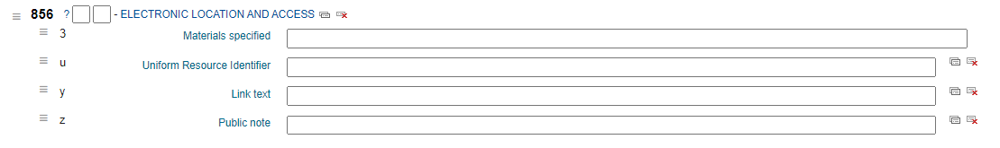
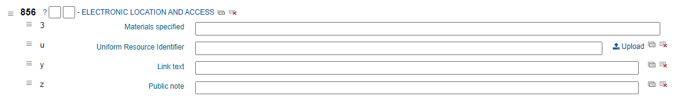
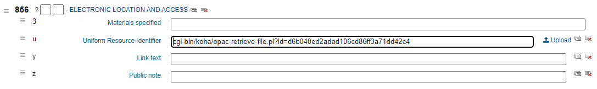
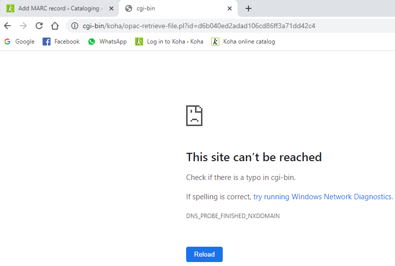

(07/10/2022)

## Mengaktifkan Upload file melalui record di Section 8

Sebelum: 

Masuk ke menu `Koha administration` -> `MARC bibliographic framework` -> Pilih MARC yang ingin diubah lalu tekan `Actions` -> `MARC Structure` -> Cari Tag 856 -> lalu buka `Actions` -> `View Subfields` -> Cari Subfield u dengan Text "Uniform Resource Identifier" -> buka `Edit`

Lalu pada kolom `Other options (choose one)` -> buka menu `Plugin` -> pilih upload.pl

Selesai, Berikut Tampilan pada menu `Add MARC record`

Sesudah: 

## Cara Upload File melalui record

Tekan tombol `Upload` pada Tag 856 baris Uniform Resource Identifier -> `Choose file` -> cari file yang ingin anda upload lalu tekan Open -> lalu tekan `Upload` -> setelah selesai lalu tekan `+ Choose` -> maka link akan tergenerate pada kolom URI : 

Namun Permasalah yang saya temui saat mencoba membuka ebook tersebut akan terjadi error :

## Kenapa ?

Hal ini dikarenakan link yang tergenerate tidak menuju ke database, Seharusnya alamat didepannya ditambahkan `http://ils-opac.pilkommedia.edu/` (Tergantung alamat ils anda)

Bagaimana cara agar menambahkan database tersebut secara otomatis? Lihat [Cara Setting Opac Base URL](../Setting_Opac_Base_URL/CaraSettingBaseURLOpac.md)