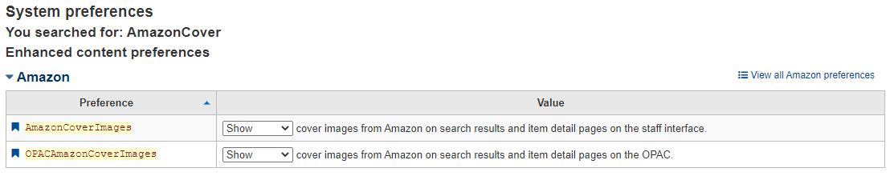

(07/10/2022)

## Cara mengatur Cover pada KOHA dan OPAC

Pertama kita perlu mengaktifkan tampilan Cover Image atau Gambar Sampul :

Langkah-langkah :
1. Masuk menu `Koha Administration`
2. Pada Kolom `Global System Preferences` Cari "AmazonCover"
3. Ubah kedua kolom tersebut menjadi Show
4. 
5. Selesai

Penjelasan : 
`AmazonCoverImages` Merupakan konfigurasi pada Koha untuk mengambil referensi Sampul buku di Amazon.com, Syaratnya buku tersebut harus memiliki ISBN (International Serial Book Number)