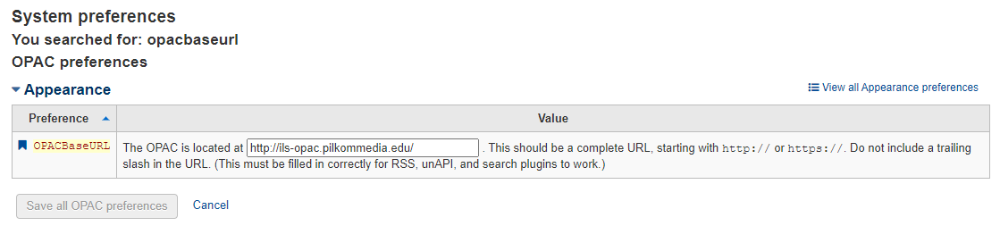
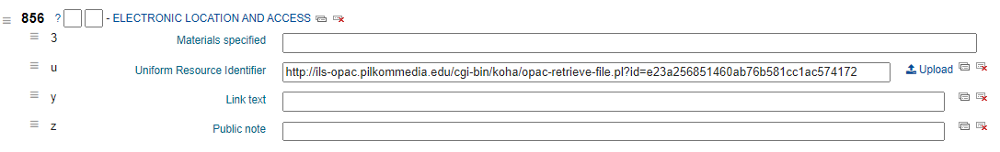

(07/10/2022)

## Cara mengatur Base URL OPAC

Masuk ke menu `Koha Administration` -> cari pada kolom pencarian "opacbaseurl" -> Lalu isi kolom Location sesuai alamat ILS anda (Pada gambar kami menggunakan "http://ils-opac.pilkommedia.edu/") 

Maka link pada kolom URI di Record akan secara otomatis generate Base tersebut didepannya

