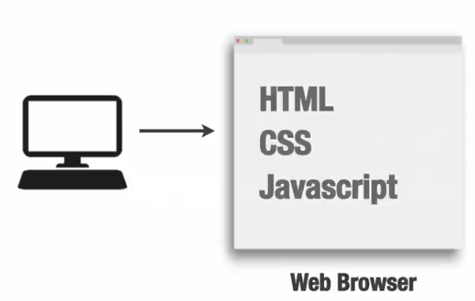
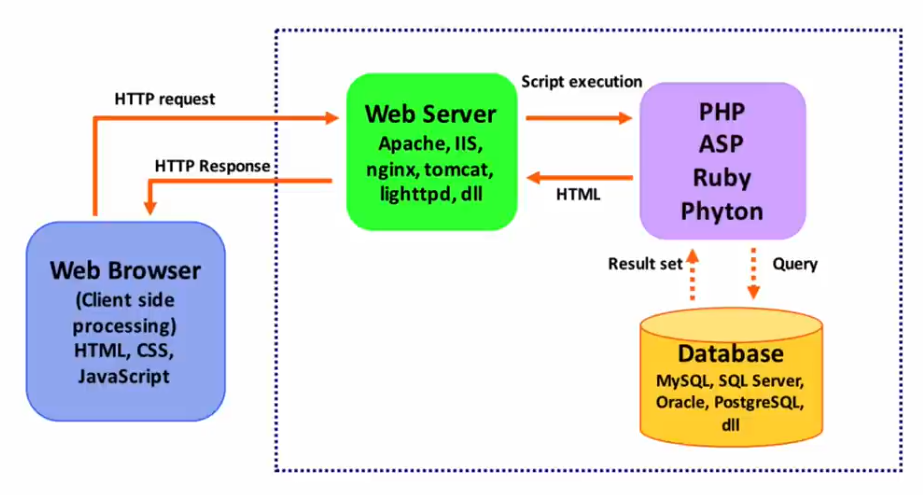

Kenapa perlu disiapkan?, Karena PHP tidak semudah HTML dan CSS

### Persiapan Lingkungan Pengambanngan
- client side vs server side scripting
  - client side scripting
    
  - server side scripting
    

Download XAMPP